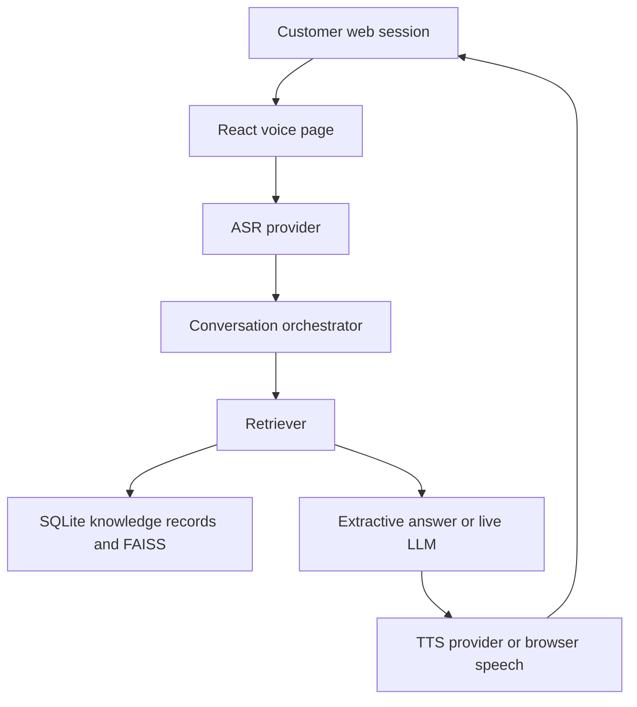
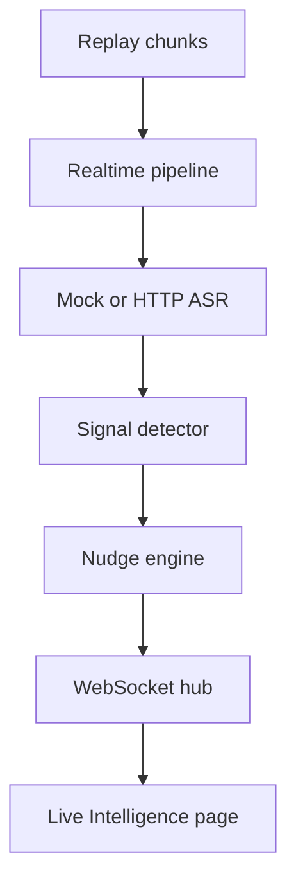

# Darwix AI Voice Intelligence Platform

Local working system for the Darwix AI Engineer assessment. It qualifies a synthetic health-insurance lead from a knowledge base, runs Philippines and Indonesia conversation flows, and emits call nudges while a transcript is still replaying.

Synthetic demo data only. The web UI is not a phone call.

To run it on a new computer, open `START_HERE.md`. Mac/Linux: `./setup.sh` then `./run.sh`. Windows: `setup.bat` then `run.bat`.

## 1. Project overview

Four connected pieces:

1. A knowledge base that ingests mixed files, cleans them, and answers with citations or a safe fallback.
2. A health-insurance qualification agent that retrieves from that knowledge base.
3. Philippines bancassurance and Indonesia multifinance flows with local wording, not a translation API.
4. A chunked call pipeline that detects signals and nudges over a WebSocket before the replay finishes.

## 2. Problem statement

The voice agent has to answer from business content it can point back to. When the content is missing, it has to say so. The Philippines and Indonesia bots have to sound like those markets. Supervisors need a nudge during the call, with a measured delay, and repeated weak alerts have to be suppressed.

## 3. Features

- Ingest PDF, text, Markdown, HTML, and CSV.
- Clean boilerplate, normalize a few insurance terms, drop near-duplicates, redact obvious PII.
- Section-aware chunks, TF-IDF vectors in FAISS, rerank, confidence threshold, citations.
- Optional sentence-transformers path. It was not executed in this environment.
- Voice state machine: consent, discovery, qualification, FAQ or objection, eligibility, callback, summary, end, escalation.
- Mock CRM summary stored on the call row.
- Taglish and Bahasa register detection.
- Real-time chunk processor, nudge cooldown, dashboard.

## 4. Architecture





More detail is in `docs/ARCHITECTURE.md`.

## 5. Tech stack

- Python 3.11+ (developed on 3.13), FastAPI, Pydantic, SQLite, WebSockets
- React, Vite, Tailwind CSS
- NumPy and FAISS
- TF-IDF embeddings by default
- sentence-transformers is implemented behind `EMBEDDING_PROVIDER=sentence-transformers` and listed in `backend/requirements-ml.txt`

## 6. Folder structure

```text
darwix-ai-assignment/
├── backend/          FastAPI app, RAG, voice, multilingual, realtime, providers
├── frontend/         React dashboard
├── data/             Synthetic knowledge, configs, scenarios
├── docs/             Design notes and measured reports
├── scripts/          Evaluation, replay, secret scan, sample PDF
├── tests/            Pytest suite
├── recordings/       Labeled macOS TTS samples, not live calls
├── transcripts/      Executed scenario transcripts
└── results/          JSON written by the evaluation run
```

## 7. Installation

```bash
cd darwix-ai-assignment
python3 -m venv .venv
source .venv/bin/activate
pip install -r backend/requirements.txt
cp .env.example .env
cd frontend && npm install && cd ..
```

## 8. Environment variables

See `.env.example`. Leave keys empty to stay in mock/local mode. Never commit `.env`.

| Variable | Role |
| --- | --- |
| `LLM_API_KEY`, `LLM_MODEL`, `LLM_BASE_URL`, `LLM_PROVIDER` | OpenAI-compatible chat. `mock` or an empty key skips the network call. |
| `ASR_API_KEY`, `ASR_PROVIDER` | External ASR. Mock returns aligned text. |
| `TTS_API_KEY`, `TTS_PROVIDER` | External TTS. Mock returns no audio bytes. |
| `VOICE_API_KEY`, `VOICE_PROVIDER` | External telephony. Default is a web session. |
| `DATABASE_URL`, `VECTOR_DB_PATH` | SQLite and FAISS directory. |
| `EMBEDDING_PROVIDER` | `tfidf` or `sentence-transformers`. |
| `CHUNK_SIZE`, `CHUNK_OVERLAP`, `CONFIDENCE_THRESHOLD` | Retrieval. |
| `NUDGE_CONFIDENCE_THRESHOLD`, `NUDGE_COOLDOWN_SECONDS` | Nudge control. |

## 9. Backend setup

```bash
cd darwix-ai-assignment
source .venv/bin/activate
PYTHONPATH=backend uvicorn app.main:create_app --factory --host 127.0.0.1 --port 8000
```

`GET http://127.0.0.1:8000/health` shows the active modes.

## 10. Frontend setup

```bash
cd darwix-ai-assignment/frontend
npm run dev
```

Open `http://127.0.0.1:5173`.

## 11. Q1 usage

Open Voice Agent. Start a web session, type, or use the microphone if the browser allows it. The buttons `Run cooperative`, `Run objection`, and `Run unsupported` replay the executed scripts through the API.

```bash
PYTHONPATH=backend python scripts/run_evaluations.py
```

Transcripts land in `transcripts/q1/`.

## 12. Q2 usage

Open Knowledge Base, or:

```bash
curl -s http://127.0.0.1:8000/kb/search \
  -H 'content-type: application/json' \
  -d '{"query":"What is the waiting period for pre-existing conditions?"}'
```

`GET /evaluation` returns the rubric results.

## 13. Q3 usage

Open Philippines Bot or Indonesia Bot and run the named scenarios. The Indonesia page shows the accent test. Actual ASR transcript quality is `NOT MEASURED` without an ASR key.

## 14. Q4 usage

Open Live Intelligence, choose `full_demo`, set speed to `1`, and start the replay. Nudges arrive on the WebSocket while later lines are still pending.

```bash
PYTHONPATH=backend python scripts/replay_call.py --scenario full_demo --speed 1
```

The script requires the backend to be running. It starts the replay. It does not print invented latency.

## 15. Testing

```bash
cd darwix-ai-assignment
PYTHONPATH=backend .venv/bin/pytest -q
```

Latest local run: 34 passed, 0 failed. See `results/test_summary.json`.

## 16. Evaluation

```bash
PYTHONPATH=backend .venv/bin/python scripts/run_evaluations.py
```

The retrieval rubric marked product, policy, qualification, FAQ, objection, and the out-of-scope fallback as `CORRECT` on the last run. Details are in `results/rag_evaluation.json` and `docs/EVALUATION.md`.

## 17. Latency

`results/latency_results.json` is the source of truth. On the last `full_demo` run, local end-to-end P50 was about 1.18 ms and P95 about 1.43 ms across 7 chunks. That is in-process work, not cloud ASR. LLM latency is `NOT MEASURED`. See `docs/LATENCY_REPORT.md`.

## 18. Demo

Follow `docs/DEMO_SCRIPT.md`. Keep the health banner visible so mock mode is obvious.

## 19. Limitations

- No live telephony provider is connected.
- Cloud ASR quality, cloud ASR latency, and LLM latency were not measured.
- Default retrieval is TF-IDF, which is lexical. The MiniLM class exists and was not run here.
- Speaker labels come from the script, not from diarization.
- This Mac had Damayanti (`id_ID`) and no Filipino voice.
- Javanese handling is a small text lexicon, not accent recognition.
- Nudge copy is rule-based. It quotes the triggering line.

## 20. Production improvements

See `docs/PRODUCTION_PLAN.md` for Postgres/pgvector, queues, auth, PII controls, provider fallbacks, and what changes at 10x scale and on noisy audio.

## API keys you can add later

Set `LLM_PROVIDER=openai` and `LLM_API_KEY` to use an OpenAI-compatible chat endpoint. The client refuses to run with an empty key. ASR, TTS, and telephony adapters fail closed instead of inventing a successful call. Those vendor SDKs are not wired yet, so a key alone does not make a phone call.

## GitHub

Create an empty repository you own, then from `darwix-ai-assignment`:

```bash
git init
git add .
git status
git commit -m "Add Darwix voice intelligence assessment"
git branch -M main
git remote add origin <your-repo-url>
git push -u origin main
```

Confirm `.env` is not staged. `scripts/check_secrets.py` is a pattern scan, not a full secret audit.
