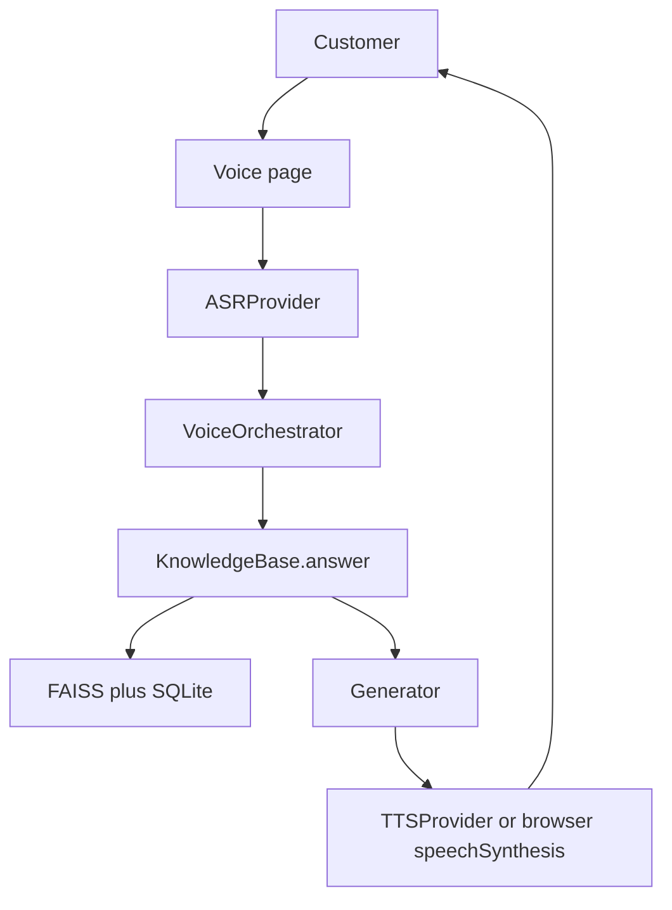
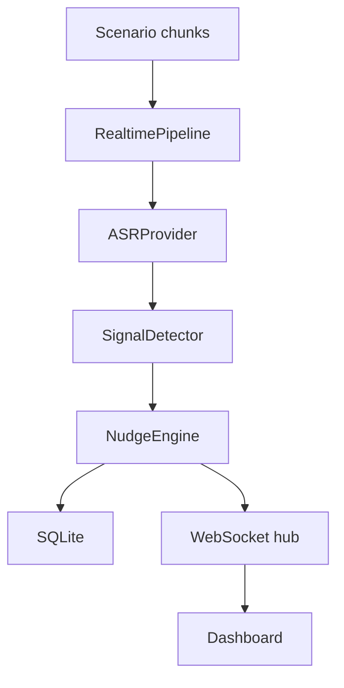

# Architecture

The project is a local monorepo. The FastAPI process owns retrieval, the conversation state machine, and the streaming nudge pipeline. The React app is a client.

## Voice path

`SYSTEM_PROMPT` in `backend/voice/prompts.py` tells a live model to stay inside retrieved context. It does not contain premiums, waiting periods, or objection scripts. Those live under `data/kb/`.

Slot filling is deterministic so the qualification tests do not depend on a model. When `LLM_API_KEY` is set and `LLM_PROVIDER=openai`, the generator can call an OpenAI-compatible chat endpoint with the retrieved chunks. If that call fails, the extractive answer is kept and `generation_mode` says so.

## Real-time path

Each chunk records ASR, signal, nudge, delivery, and end-to-end times with `time.perf_counter`. The replay sleep is separate from those timings. Speed `1` waits on the script clock so the dashboard updates during the call. Speed `0` is what the latency file uses.

## Providers

| Interface | Default | Live behavior |
| --- | --- | --- |
| `LLMProvider` | No client. Extractive answers. | `OpenAICompatibleLLM` posts to `/chat/completions` only with a key. |
| `ASRProvider` | `MockASR` returns aligned text. | Named HTTP provider raises. It does not invent a transcript. |
| `TTSProvider` | No audio bytes. | Named HTTP provider raises. The browser may speak locally. |
| `VoiceProvider` | Web session id, no phone number. | Named HTTP provider raises. No call is placed. |

## Data

SQLite tables: `knowledge_records`, `calls`, `transcripts`, `retrieval_logs`, `signals`, `nudges`, `latency_metrics`, `evaluation_results`.

FAISS `IndexFlatIP` stores L2-normalized TF-IDF vectors. The manifest at `data/vector/manifest.json` records the model name after ingest. That directory is gitignored and rebuilt on startup.

## Markets

`VoiceOrchestrator` takes `health`, `philippines`, or `indonesia`. Market modules supply prompts, consent words, fallback strings, and retrieval filters. Health eligibility uses `data/kb/health/rules.json` plus a retrieved explanation. The other two markets record a preliminary lead and do not pretend to underwrite.
